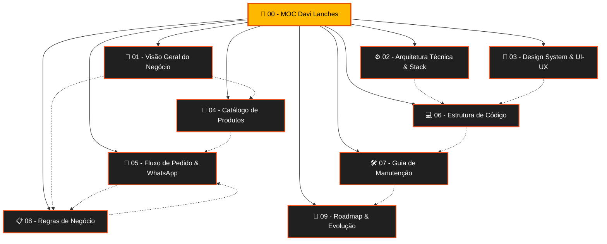

# 🍔 Davi Lanches Hamburgueria — Mapa de Conteúdo (MOC)

> [!INFO] **Visão Rápida do Projeto**
> **Davi Lanches** é uma aplicação web moderna de **Cardápio Digital & Delivery Direto via WhatsApp**, desenvolvida especialmente para a hamburgueria tradicional fundada em 2015 no Rio de Janeiro. O sistema permite navegação fluida por categorias, personalização avançada de lanches (ingredientes grátis e adicionais pagos), cálculo em tempo real de frete fixo (R$ 5,00) ou retirada, e checkout automatizado com envio de pedidos formatados diretamente para o WhatsApp oficial da loja.

---

## 🧭 Navegação Rápida — Notas do Cofre

Aqui está a estrutura de conhecimento interligada do projeto. Clique nos links para acessar o detalhamento de cada área:

| # | Nota | Descrição & Escopo | Tags Principais |
|---|---|---|---|
| **01** | [[01 - Visão Geral do Negócio]] | Origem desde 2015, proposta de valor, canais de atendimento, diferenciais competitivos e horários. | `#negocio` `#branding` |
| **02** | [[02 - Arquitetura Técnica & Stack]] | Arquitetura Jamstack, tecnologias (HTML5, Vanilla CSS, JS ES6+), performance e responsividade. | `#arquitetura` `#frontend` |
| **03** | [[03 - Design System & UI-UX]] | Paleta de cores (Dark Theme, Âmbar, Laranja), tipografia, componentes, glassmorphism e micro-animações. | `#design-system` `#ui-ux` |
| **04** | [[04 - Catálogo de Produtos & Precificação]] | Tabela completa de Combos (1 a 10), Sanduíches (11 opções), Batatas Fritas, Bebidas e Adicionais. | `#catalogo` `#precos` |
| **05** | [[05 - Fluxo de Pedido & Checkout WhatsApp]] | Jornada do usuário, regras do carrinho, lógica do frete fixo, validação de endereço e payload do WhatsApp. | `#fluxo-pedido` `#whatsapp` |
| **06** | [[06 - Estrutura de Código & Componentes]] | Análise técnica aprofundada de `index.html`, `styles.css`, `app.js`, pastas de assets e modelos de dados. | `#codigo` `#javascript` |
| **07** | [[07 - Guia de Manutenção & Atualização]] | Manual prático para alterar preços, cadastrar novos lanches, atualizar fotos, banners e número do WhatsApp. | `#manutencao` `#guia` |
| **08** | [[08 - Regras de Negócio & Políticas]] | Frete fixo, troco em dinheiro, opções de retirada, horário de entrega e tratamento de exceções. | `#regras` `#politicas` |
| **09** | [[09 - Roadmap & Oportunidades de Evolução]] | Próximas fases sugeridas: PWA instalável, painel administrativo, integração automática PIX e impressão de pedidos. | `#roadmap` `#futuro` |

---

## 📊 Grafo de Relacionamentos do Sistema

---

## ⚡ Indicadores-Chave do Projeto (KPIs Técnicos e Negócio)

> [!TIP] **Métricas de Destaque**
> - **Tempo de Carregamento**: Ultrarrápido (< 500ms), sem frameworks pesados como React/Angular.
> - **Dependências Externas**: Mínimas (apenas Font Awesome 6 e Google Fonts via CDN).
> - **Custo de Hospedagem**: Zero (compatível com GitHub Pages, Vercel, Netlify ou Cloudflare Pages).
> - **Taxa de Conversão**: Maximizada pelo checkout direto no WhatsApp sem necessidade de login ou download de aplicativo.
> - **Persistência de Dados**: Carrinho salvo automaticamente no `localStorage` do navegador do cliente.

---

## 🏷️ Nuvem de Tags do Cofre

- `#projeto/davi-lanches` — Todas as notas pertencentes ao ecossistema
- `#moc` — Índices e mapas de conteúdo
- `#frontend` — Implementação visual e lógica cliente
- `#design-system` — Tokens visuais, CSS e identidade da marca
- `#cardapio-digital` — Catálogo, fotos e descrições dos itens
- `#whatsapp` — Integração de checkout e envio de mensagem estruturada
- `#regras-de-negocio` — Precificação, taxas de entrega e horários

---
*Documentação gerada com padrão Obsidian para o projeto **Davi Lanches Hamburgueria**.*
