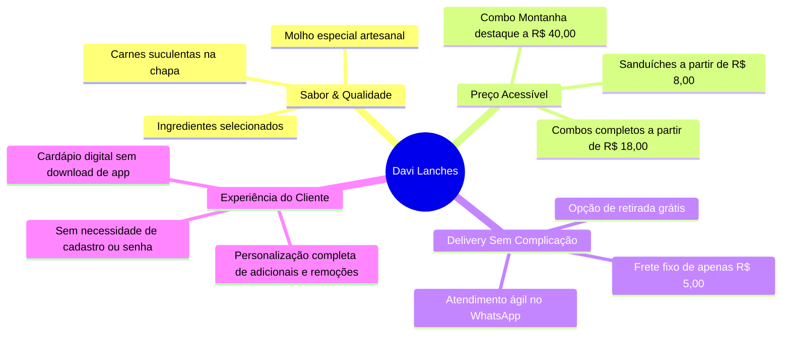

# 🏢 Visão Geral do Negócio — Davi Lanches Hamburgueria

> [!QUOTE] *"Sabor em cada mordida!"*  
> — Lema oficial da Davi Lanches Hamburgueria (Since 2015).

---

## 📖 1. História e Identidade da Marca

A **Davi Lanches Hamburgueria** atua no mercado de alimentação rápida e artesanal no **Rio de Janeiro desde 2015**. Construiu sua reputação oferecendo sanduíches generosos, ingredientes frescos na chapa, molho especial artesanal e porções fartas com excelente custo-benefício.

### Dados Institucionais:
- **Nome Comercial**: Davi Lanches Hamburgueria
- **Fundação**: 2015
- **Localização**: Rio de Janeiro - RJ
- **WhatsApp Oficial de Pedidos**: `(21) 97311-2436` (Código Internacional: `5521973112436`)
- **Instagram Oficial**: [@DAVILANCHES](https://instagram.com/DAVILANCHES)
- **Horário de Atendimento**: Terça a Domingo, a partir das 18:00h
- **Canais de Venda**: Cardápio Digital Próprio (Web), WhatsApp Direto, iFood e Balcão

---

## 🎯 2. Proposta de Valor & Diferenciais Competitivos

O modelo de negócio da Davi Lanches une a tradição do lanche carioca farto com a agilidade digital moderna:

### Principais Pilares:
1. **Frete Fixo de R$ 5,00**: Uma das principais vantagens mercadológicas. Enquanto aplicativos terceiros cobram taxas variáveis elevadas de frete por distância, a Davi Lanches mantém R$ 5,00 fixo, facilitando a decisão de compra.
2. **Independência de Taxas de Marketplaces**: Plataformas como iFood cobram entre 12% a 27% de comissão por venda. O cardápio digital próprio permite que o estabelecimento retenha 100% da margem de lucro.
3. **Cardápio Visual e Nostálgico**: O site preserva os posters gráficos tradicionais da hamburgueria através de um recurso de ampliação interativa (Lightbox), gerando familiaridade com os clientes antigos e transparência para os novos.
4. **Customização Imediata**: O cliente pode remover ingredientes (salada, cebola, molho) sem custo, ou adicionar carnes extras, ovos, bacon e cheddar de forma intuitiva.

---

## 👥 3. Perfil do Público-Alvo (Personas)

- **Jovens e Universitários**: Buscam lanches à noite, combos compartilháveis para grupos ou jogos de futebol, valorizando preço baixo e velocidade.
- **Famílias e Casais**: Optam por combos maiores (como Combo 01 ou Combo 04 com refrigerante de 2 litros e batata grande inclusos).
- **Clientes Fiéis do Bairro**: Pessoas que conhecem a loja desde 2015 e preferem pedir no balcão ou receber no conforto de casa sem atritos tecnológicos.

---

## 💳 4. Políticas de Pagamento & Atendimento

A operação aceita os principais meios de pagamento atuais do Brasil:
- **PIX Instantâneo**: Chave informada diretamente no WhatsApp após envio do pedido.
- **Cartão de Crédito**: Levado máquina na entrega ou pago no balcão.
- **Cartão de Débito**: Maquininha sem fio no delivery.
- **Dinheiro**: Com cálculo prévio de troco solicitado no próprio formulário de checkout.

---

## 🔗 Navegação Entre Notas
- Próxima Nota: [[02 - Arquitetura Técnica & Stack]]
- Mapa Geral: [[00 - MOC (Map of Content) - Davi Lanches]]
- Produtos & Cardápio: [[04 - Catálogo de Produtos & Precificação]]
- Regras Comerciais: [[08 - Regras de Negócio & Políticas]]
