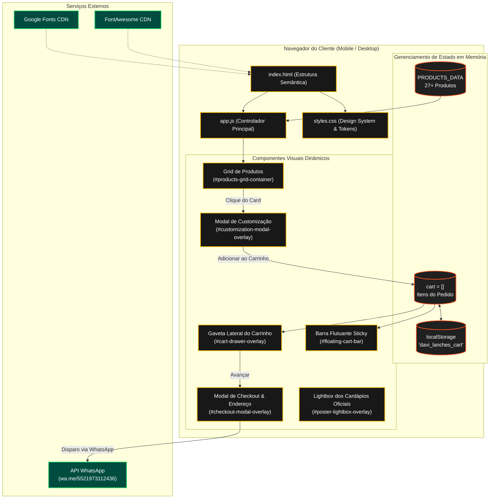
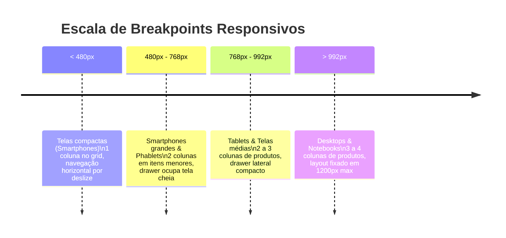

# ⚙️ Arquitetura Técnica & Stack — Davi Lanches

> [!NOTE] **Princípio Norteador do Projeto**
> **Simplicidade, Robustez e Desempenho Extremo**. O sistema foi concebido segundo o modelo **Jamstack estático**, eliminando a necessidade de servidores backend complexos, bancos de dados relacionais e custos mensais de infraestrutura, garantindo 100% de disponibilidade e carregamento instantâneo no celular do cliente.

---

## 🛠️ 1. Matriz de Tecnologias (Stack)

| Camada | Tecnologia | Justificativa Técnica |
|---|---|---|
| **Marcação** | **HTML5 Semântico** | Uso estrito de `<header>`, `<main>`, `<section>`, `<article>`, `<nav>` e `<footer>`, garantindo acessibilidade (a11y) e SEO otimizado. |
| **Estilização** | **CSS3 Moderno Puro (Vanilla)** | Variáveis CSS (Design Tokens), CSS Grid responsivo, Flexbox, efeitos de *glassmorphism* (`backdrop-filter`) e animações GPU-accelerated. Sem sobrecarga de Tailwind ou Bootstrap. |
| **Lógica & Estado** | **JavaScript ES6+ (Vanilla)** | Manipulação reativa do DOM, renderização orientada a dados (`map`, `filter`, `reduce`), persistência local com `localStorage` e eventos de teclado/touch. |
| **Ícones** | **Font Awesome 6.4.0 (CDN)** | Biblioteca abrangente de ícones vetoriais em SVG/Webfonts para ações de compra, carrinho, WhatsApp e redes sociais. |
| **Tipografia** | **Google Fonts** | Combinação com as famílias `Montserrat` (logos/títulos de impacto), `Poppins` (botões e preços) e `Inter` (textos de leitura). |
| **Integração de Saída** | **WhatsApp Click-to-Chat API** | Mecanismo de checkout sem fricção que transforma o estado do carrinho em mensagem codificada (`wa.me/5521973112436?text=...`). |

---

## 🏗️ 2. Diagrama de Arquitetura & Fluxo de Dados



---

## ⚡ 3. Modelo de Dados em Memória (Schemas)

### 3.1. Estrutura de um Produto (`PRODUCTS_DATA`)
```javascript
{
  id: "s9",                                // Identificador único (c1..c10, s1..s11, b1..b3, d1..d3)
  name: "X-Montanha",                      // Nome exibido no cardápio
  price: 15.00,                            // Valor unitário base em BRL
  category: "sanduiches",                  // 'combos' | 'sanduiches' | 'batatas' | 'bebidas'
  description: "Pão, 2 carnes, 2 queijos, cheddar, ovo, bacon, salada e molho especial.",
  image: "assets/images/x_montanha.jpg",   // Caminho da imagem local
  badge: "Mais Pedido",                    // Selo promocional (opcional)
  badgeType: "mais-pedido"                 // Classe CSS do selo ('promo' | 'mais-pedido')
}
```

### 3.2. Estrutura de um Item no Carrinho (`cartItem`)
```javascript
{
  cartItemId: "1727978400000abc1",         // ID único gerado no momento da adição
  productId: "s9",                         // Referência ao produto do catálogo
  name: "X-Montanha",
  basePrice: 15.00,
  unitPrice: 18.50,                        // Preço base + adicionais pagos
  quantity: 2,
  removals: ["Sem salada", "Sem cebola"],  // Ingredientes gratuitos removidos
  addons: [                                // Adicionais pagos selecionados
    { name: "Carne extra", price: 3.50 }
  ],
  obs: "Ponto da carne bem passado"        // Observações livres digitadas pelo cliente
}
```

---

## 📱 4. Estratégia de Responsividade (Breakpoints)

O design adota abordagem **Mobile-First** com otimização progressiva:



- **Dispositivos Móveis (< 768px)**:
  - Drawer do carrinho e Modais utilizam largura total (`100vw`).
  - Barra de carrinho flutuante fixada no rodapé (`bottom: 0`, `z-index: 1000`).
  - Navegação de categorias em carrossel horizontal com rolagem suave (`overflow-x: auto`).
- **Desktops e Telas Grandes (> 992px)**:
  - Largura máxima do container limitada a `1200px` centralizado.
  - Modais centralizados em popup com backdrop semitransparente.
  - Grid de produtos distribuído em colunas repetitivas (`repeat(auto-fill, minmax(280px, 1fr))`).

---

## 🔒 5. Segurança & Privacidade

> [!CHECK] **Compliance e LGPD**
> - **Sem Armazenamento de Dados Sensíveis**: Não há banco de dados central guardando dados de cartões de crédito ou senhas de usuários.
> - **Transmissão Segura**: Todas as informações preenchidas pelo cliente (nome, telefone, endereço) são transmitidas diretamente de seu próprio aparelho para o WhatsApp do restaurante por meio de criptografia de ponta a ponta nativa do WhatsApp.
> - **Limpeza de Sessão**: Ao confirmar o pedido, o carrinho no `localStorage` é esvaziado automaticamente.

---

## 🔗 Navegação Entre Notas
- Anterior: [[01 - Visão Geral do Negócio]]
- Próxima Nota: [[03 - Design System & UI-UX]]
- Mapa Geral: [[00 - MOC (Map of Content) - Davi Lanches]]
- Código-Fonte: [[06 - Estrutura de Código & Componentes]]
