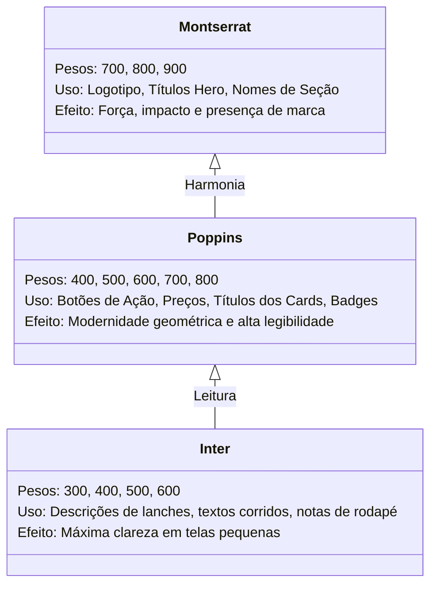

# 🎨 Design System & UI-UX — Davi Lanches Hamburgueria

> [!TIP] **Conceito Visual: "Dark Delicious & High Energy"**  
> A identidade visual foi projetada para despertar o apetite e valorizar a fotografia dos hambúrgueres artesanais. Utiliza um fundo escuro profundo (`#121212`), que destaca as cores quentes do queijo derretido, do pão dourado e do fogo na chapa representados pelo **Âmbar (`#FFB800`)** e pelo **Laranja Vivo (`#FF5722`)**, aliados ao **Verde Oficial do WhatsApp (`#25D366`)** para orientar as ações de conversão.

---

## 🎨 1. Paleta de Cores e Tokens CSS

As variáveis globais declaradas na raiz (`:root`) em `styles.css`:

| Token CSS | Hex / RGBA | Amostra | Finalidade & Aplicação |
|---|---|---|---|
| `--bg-dark` | `#121212` | ⬛ | Fundo mestre da aplicação, criando contraste alto e conforto visual noturno. |
| `--bg-dark-alt` | `#181818` | ⬛ | Fundo secundário para cabeçalho, rodapé e containers de destaque. |
| `--surface-card` | `#202020` | ⬛ | Superfície padrão dos cards de produto e blocos informativos. |
| `--surface-card-hover` | `#2a2a2a` | ⬛ | Estado de foco e hover com elevação visual. |
| `--surface-elevated` | `#2d2d2d` | ⬛ | Modais sobrepostos e gaveta lateral do carrinho. |
| `--brand-amber` | `#FFB800` | 🟨 | Destaques de preços, selos promocionais, estrelas e avaliações. |
| `--brand-amber-glow` | `rgba(255, 184, 0, 0.35)` | ✨ | Efeito de brilho radiante (*glow*) ao redor de cards e botões ativos. |
| `--brand-orange` | `#FF5722` | 🟧 | Botões primários de ação (*Call to Action* - CTA) e destaques de fogo. |
| `--brand-orange-dark`| `#E65100` | 🟧 | Gradiente da barra de anúncio e bordas de destaque. |
| `--whatsapp-green` | `#25D366` | 🟩 | Botão de finalização de pedido, pílula de contato e ícones de entrega grátis. |
| `--text-main` | `#FFFDF9` | ⬜ | Tipografia primária de leitura, títulos e valores monetários. |
| `--text-muted` | `#A3A3A3` | ◽ | Ingredientes secundários, observações, rótulos e legendas. |
| `--border-light` | `rgba(255, 255, 255, 0.08)` | ▫️ | Linhas divisórias sutis sem poluir a interface. |

---

## 🔤 2. Tipografia & Hierarquia de Texto

São utilizadas 3 famílias tipográficas complementares importadas do Google Fonts:

---

## 🧩 3. Componentes Centrais da Interface

### 3.1. Barra de Anúncios Superior (`.top-bar`)
- Faixa no topo da página com gradiente animado entre `#E65100` e `#FF5722`.
- Apresenta o indicador pulsante com animação CSS `@keyframes pulse`:
  - `ABERTO AGORA • DELIVERY ATIVO`
  - `FRETE FIXO R$ 5,00 EM TODOS OS PEDIDOS`
  - Link direto de WhatsApp `(21) 97311-2436`.

### 3.2. Cartão de Destaque Hero (`.hero-showcase`)
- Apresenta o carro-chefe da hamburgueria: **COMBO MONTANHA** (3 X-Montanha por R$ 40,00).
- Layout assimétrico com mídia fotográfica em alta definição à direita e informações de valor à esquerda.
- Botão direto com chamada rápida: `Pedir por R$ 40,00` abrindo imediatamente o modal de configuração.

### 3.3. Barra de Filtros & Navegação por Categorias (`.category-nav`)
- Guias com estilo de pílulas (*chips*) com ícones temáticos do Font Awesome:
  - 🌐 *Todos os Itens*
  - 🔥 *Combos Promocionais*
  - 🍔 *Sanduíches*
  - 🍟 *Batatas Fritas*
  - 🥤 *Bebidas*
- Suporte a rolagem horizontal suave (*scroll snap*) em smartphones.

### 3.4. Cards de Produto (`.product-card`)
- Foto com efeito de zoom suave ao passar o cursor (`transform: scale(1.05)`).
- Tag superior indicando promoções (`badge-tag` com gradiente âmbar ou laranja).
- Exibição destacada de preço em moeda brasileira `formatBRL(item.price)`.
- Botão "Pedir" com clique direto para abrir o modal de personalização.

### 3.5. Gaveta do Carrinho (*Slide-Over Drawer* - `.cart-drawer`)
- Desliza da lateral direita suavemente (`transform: translateX(0)`).
- Seletor rápido de tipo de pedido:
  - 🛵 **Entrega (Frete R$ 5)**
  - 🏪 **Retirada (Grátis)**
- Controles de quantidade (+ / -) em cada item individual.
- Tag list destacando adicionais pagos (em verde) e itens removidos (em vermelho/laranja).

### 3.6. Barra Flutuante de Carrinho (`.floating-cart-bar`)
- Elemento fixado no rodapé com `z-index: 999`.
- Exibe o contador de itens com animação de surgimento quando `totalItemsCount > 0`.
- Apresenta o valor total já incluindo o frete fixo calculado dinamicamente.

### 3.7. Lightbox de Cardápios Oficiais (`.lightbox-modal`)
- Modal em tela cheia com fundo escurecido (`backdrop-filter: blur(8px)`).
- Permite aos clientes ampliarem em alta resolução os cartazes de cardápios impressos de sanduíches e combos.

---

## ✨ 4. Micro-Interações & Animações

> [!NOTE] **Princípios de Animação**
> - **Transições Suaves**: Uso consistente de `cubic-bezier(0.4, 0, 0.2, 1)`.
> - **Retorno Tátil**: Botões possuem efeito `:active` com leve redução de escala (`transform: scale(0.97)`).
> - **Toasts Informativos**: Alertas de adição ou remoção de itens surgem da direita com `@keyframes slideInRight` e desaparecem sozinhos após 2,6 segundos.
> - **Teclado Amigável**: Tecla `Escape` fecha simultaneamente qualquer modal ou gaveta ativa no sistema.

---

## 🔗 Navegação Entre Notas
- Anterior: [[02 - Arquitetura Técnica & Stack]]
- Próxima Nota: [[04 - Catálogo de Produtos & Precificação]]
- Mapa Geral: [[00 - MOC (Map of Content) - Davi Lanches]]
- Código & Estilos: [[06 - Estrutura de Código & Componentes]]
