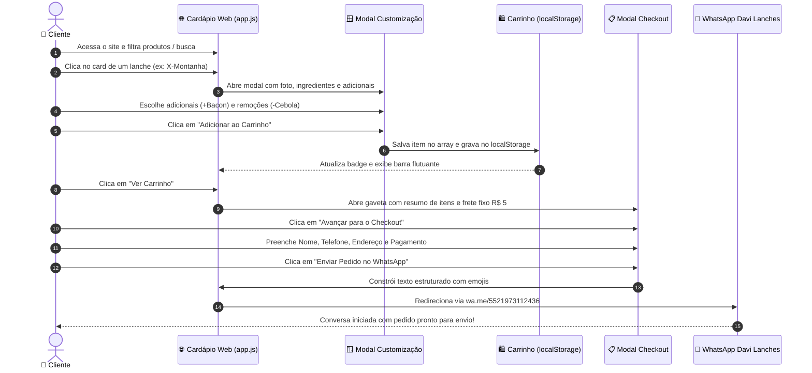

# 🛒 Fluxo de Pedido & Checkout WhatsApp — Davi Lanches

> [!IMPORTANT] **Eficiência Operacional sem Atrito**  
> O diferencial deste cardápio digital é a **fricção zero**: o cliente não precisa criar conta com senha, validar e-mail ou passar por telas de carregamento pesadas. Em menos de 1 minuto ele escolhe, personaliza, preenche os dados de entrega e envia o pedido pronto para a chapa pelo WhatsApp.

---

## 🗺️ 1. Diagrama de Sequência da Jornada do Usuário



---

## 📝 2. Estrutura da Mensagem Enviada ao WhatsApp

O método `handleOrderSubmit(e)` em `app.js` compila todas as informações do pedido em uma mensagem legível e profissional para a equipe da cozinha e o motoboy:

### Exemplo de Mensagem Gerada:

```text
🍔 *NOVO PEDIDO - DAVI LANCHES* 🍔
------------------------------------
👤 *Cliente:* Lucas Evangelista
📞 *Telefone:* (21) 98765-4321
🛵 *Tipo:* Entrega (Delivery)
📍 *Endereço:* Rua das Palmeiras, Nº 142 - Centro (Apt 302, próx. à padaria)

🛒 *ITENS DO PEDIDO:*
1. *1x Combo 05 - Combo Montanha* - R$ 40,00
2. *2x X-Montanha* - R$ 36,00
   └ *Adicionais:* Bacon, Queijo Cheddar Cremoso
   └ *Remover:* Sem cebola
   └ *Obs:* Carne bem passada, caprichar no molho especial!

------------------------------------
💵 *Subtotal dos Itens:* R$ 76,00
🛵 *Taxa de Entrega (Frete Fixo):* R$ 5,00
💰 *VALOR TOTAL A PAGAR:* R$ 81,00
------------------------------------
💳 *Forma de Pagamento:* Dinheiro
💵 *Troco para:* R$ 100,00
------------------------------------
Davi Lanches - Sabor em cada mordida! 🍔🔥
```

---

## 🛵 3. Lógica de Alternância: Entrega vs Retirada

A aplicação mantém em sincronia a variável global `deliveryType`:

```mermaid
stateDiagram-v2
    [*] --> Delivery: Padrão Inicial

    Delivery --> Pickup: Usuário clica em 'Retirada no Local'
    Pickup --> Delivery: Usuário clica em 'Entrega'

    state Delivery {
        Frete: R$ 5,00 fixo somado ao total
        Campos: Rua, Número, Bairro e Complemento obrigatórios
    }

    state Pickup {
        Frete: Grátis (R$ 0,00)
        Campos: Oculta campos de endereço na tela
    }
```

- **Ao selecionar Entrega**:
  - `deliveryType = 'delivery'`
  - Adiciona `DELIVERY_FEE` (R$ 5,00) ao total final.
  - Exibe o wrapper `#address-fields-wrapper`.
  - Valida se Rua, Número e Bairro foram preenchidos antes do envio.
- **Ao selecionar Retirada no Local**:
  - `deliveryType = 'pickup'`
  - Isenta a taxa de frete (`R$ 0,00`).
  - Oculta o formulário de endereço no checkout.
  - A mensagem no WhatsApp estampa: `📍 Endereço: Retirada no Local (Hamburgueria)`.

---

## 💵 4. Controle Dinâmico de Troco para Dinheiro

Caso o cliente selecione a forma de pagamento **Dinheiro**:
1. O evento `change` dos rádios de pagamento identifica a opção `Dinheiro`.
2. O contêiner `#cash-change-wrapper` muda seu display para `block`.
3. O cliente preenche o campo `"Precisa de troco para quanto?"`.
4. Esse valor é inserido automaticamente no comprovante enviado ao atendente.

---

## 💾 5. Persistência de Dados e Limpeza de Sessão

> [!TIP] **Segurança na Experiência do Cliente**
> - Se o cliente fechar o navegador acidentalmente ou atender uma ligação, o carrinho permanece gravado em `localStorage.getItem("davi_lanches_cart")`.
> - Após o cliente clicar em **"Enviar Pedido no WhatsApp"**, o carrinho é esvaziado (`cart = []`), o `localStorage` é sincronizado e a gaveta é fechada, evitando pedidos duplicados.

---

## 🔗 Navegação Entre Notas
- Anterior: [[04 - Catálogo de Produtos & Precificação]]
- Próxima Nota: [[06 - Estrutura de Código & Componentes]]
- Mapa Geral: [[00 - MOC (Map of Content) - Davi Lanches]]
- Regras Comerciais: [[08 - Regras de Negócio & Políticas]]
