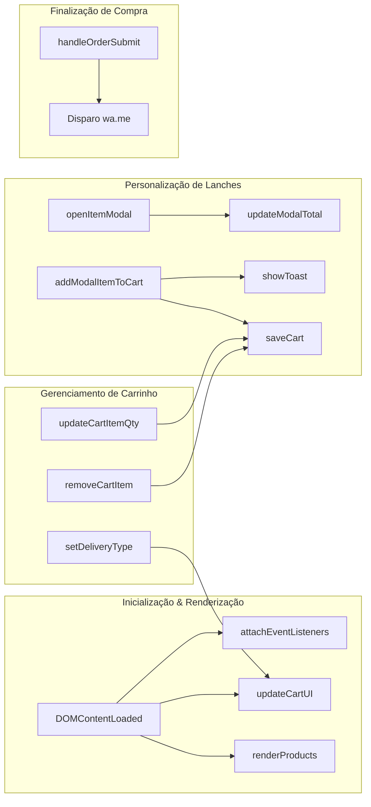

# 💻 Estrutura de Código & Componentes — Davi Lanches

> [!NOTE] **Organização Limpa e Modular**  
> Todo o projeto foi estruturado em arquivos limpos, sem necessidade de etapas intermediárias de compilação (*bundlers* como Webpack ou Vite), permitindo manutenção instantânea e facilidade de leitura.

---

## 📁 1. Árvore de Diretórios do Projeto

```text
DAVI LANCHES/
├── index.html                   # Estrutura completa, modais e marcação semântica
├── styles.css                   # Design tokens, estilos de componentes e media queries (1700+ linhas)
├── app.js                       # Banco de dados de produtos, carrinho e disparo WhatsApp (875 linhas)
├── assets/
│   └── images/                  # Imagens otimizadas para carregamento web
│       ├── logo_davi_lanches.jpg
│       ├── combo_montanha_banner.jpg
│       ├── combo_01_banner.jpg
│       ├── combo_02_banner.jpg
│       ├── x_montanha.jpg
│       ├── x_bacon.jpg
│       ├── batata_frita.jpg
│       ├── cocacola_2l.jpg
│       ├── guaracamp.jpg
│       ├── refrigerantes.jpg
│       ├── cardapio_combos_poster.jpg
│       └── cardapio_sanduiches_poster.jpg
├── FOTOS/                       # Arquivos originais de alta resolução, mídias e vídeos
│   ├── animacaodavi.mp4
│   ├── logodavilanches.jpg
│   └── ...
└── DAVI LANCHES SITE/           # Cofre Oficial de Documentação Obsidian
    ├── .obsidian/               # Configurações do cofre Obsidian
    └── davi lanches/            # Notas interligadas da base de conhecimento
```

---

## 📄 2. Anatomia do `index.html`

O documento principal está dividido em blocos lógicos bem identificados:

| Bloco / Seção | Seletor Principal | Descrição & Conteúdo |
|---|---|---|
| **Barra Superior** | `.top-bar` | Status de funcionamento em tempo real, frete e telefone com link WhatsApp. |
| **Cabeçalho Principal** | `.main-header` | Logo oficial estilizado, pílula de contato direto e botão do carrinho com contador. |
| **Destaque Hero** | `.hero-showcase` | Apresentação do Combo Montanha, gatilho de pedido e banner promocional. |
| **Barra de Controles** | `.controls-wrapper` | Campo de busca `#menu-search-input` com botão limpar e abas de categorias. |
| **Grid do Cardápio** | `#products-grid-container` | Contêiner dinâmico onde os 27 produtos são injetados pelo JavaScript. |
| **Posters Oficiais** | `.posters-section` | Galeria com os cartazes físicos para clique e ampliação em Lightbox. |
| **Modal de Customização** | `#customization-modal-overlay` | Janela para escolha de adicionais, remoções, observações e quantidades. |
| **Barra Inferior Sticky** | `#floating-cart-bar` | Barra flutuante que surge quando há produtos selecionados no carrinho. |
| **Gaveta do Carrinho** | `#cart-drawer-overlay` | Painel lateral (*slide-over*) para conferir itens, alternar modo de entrega e avançar. |
| **Modal de Checkout** | `#checkout-modal-overlay` | Formulário para coleta de dados de entrega e forma de pagamento. |
| **Lightbox de Posters** | `#poster-lightbox-overlay` | Modal em tela cheia com zoom dos cartazes do cardápio. |
| **Notificações Toast** | `#toast-container` | Alertas dinâmicos de adição ou remoção de itens. |
| **Rodapé Principal** | `.main-footer` | Redes sociais, horários, formas de pagamento aceitas e copyright. |

---

## ⚙️ 3. Funções e Controladores do `app.js`

O arquivo `app.js` atua como o cérebro da aplicação. Abaixo estão as principais funções e suas responsabilidades:



### Tabela Detalhada de Funções:

| Função | Parâmetros | Responsabilidade Técnica |
|---|---|---|
| `formatBRL(value)` | `value: Number` | Converte números em string formatada em moeda brasileira (`pt-BR`, `BRL`). |
| `renderProducts()` | Nenhum | Filtra `PRODUCTS_DATA` por categoria ativa e texto de busca; gera os cards HTML. |
| `openItemModal(productId)`| `productId: String` | Localiza o produto, preenche dados do modal, redefine checkboxes e abre a janela. |
| `closeModal()` | Nenhum | Fecha o modal de customização e reativa a rolagem da página. |
| `updateModalTotal()` | Nenhum | Soma o preço base do produto aos adicionais selecionados e multiplica pela quantidade. |
| `addModalItemToCart()` | Nenhum | Monta o objeto `cartItem`, adiciona ao array `cart`, grava no `localStorage` e exibe o toast. |
| `saveCart()` | Nenhum | Serializa o array `cart` em JSON e armazena na chave `'davi_lanches_cart'`. |
| `updateCartUI()` | Nenhum | Recalcula totais, sincroniza contadores, badges, valores da gaveta e modal de checkout. |
| `updateCartItemQty(id, delta)` | `cartItemId, delta` | Incrementa (+1) ou decrementa (-1) a quantidade do item; se zerar, exclui o item. |
| `removeCartItem(id)` | `cartItemId: String` | Remove o item selecionado e atualiza a interface. |
| `setDeliveryType(type)` | `type: 'delivery' \| 'pickup'` | Alterna a taxa de entrega (R$ 5,00 ou Grátis) e exibe/oculta os campos de endereço. |
| `openPosterLightbox(src, caption)` | `src, caption` | Exibe o poster oficial ampliado em tela cheia com legenda. |
| `showToast(msg)` | `msg: String` | Injeta toast animado de feedback com ícone de sucesso no canto superior. |
| `attachEventListeners()` | Nenhum | Registra listeners de clique, digitação, teclado (tecla Escape) e submit do formulário. |
| `handleOrderSubmit(e)` | `e: Event` | Valida campos, compila a mensagem formatada para WhatsApp e redireciona o cliente. |

---

## 🎨 4. Organização do `styles.css`

O arquivo `styles.css` foi estruturado em blocos bem documentados:
1. **Design Tokens & Variáveis Globais** (linhas 1 a 45)
2. **Reset & Estilos Base** (linhas 46 a 95)
3. **Barra de Anúncios Superior** (linhas 96 a 150)
4. **Header & Navegação de Marca** (linhas 151 a 240)
5. **Seção Hero & Banners** (linhas 241 a 380)
6. **Barra de Busca & Abas de Categorias** (linhas 381 a 510)
7. **Grid de Produtos & Product Cards** (linhas 511 a 700)
8. **Modais & Janelas Flutuantes** (linhas 701 a 920)
9. **Gaveta Lateral do Carrinho (Slide-over)** (linhas 921 a 1150)
10. **Formulário de Checkout & Formas de Pagamento** (linhas 1151 a 1380)
11. **Barra Flutuante do Carrinho (Sticky Footer)** (linhas 1381 a 1480)
12. **Toasts & Feedback Visual** (linhas 1481 a 1550)
13. **Rodapé Oficial** (linhas 1551 a 1640)
14. **Media Queries & Otimizações Mobile** (linhas 1641 a 1707)

---

## 🔗 Navegação Entre Notas
- Anterior: [[05 - Fluxo de Pedido & Checkout WhatsApp]]
- Próxima Nota: [[07 - Guia de Manutenção & Atualização]]
- Mapa Geral: [[00 - MOC (Map of Content) - Davi Lanches]]
- Arquitetura Geral: [[02 - Arquitetura Técnica & Stack]]
