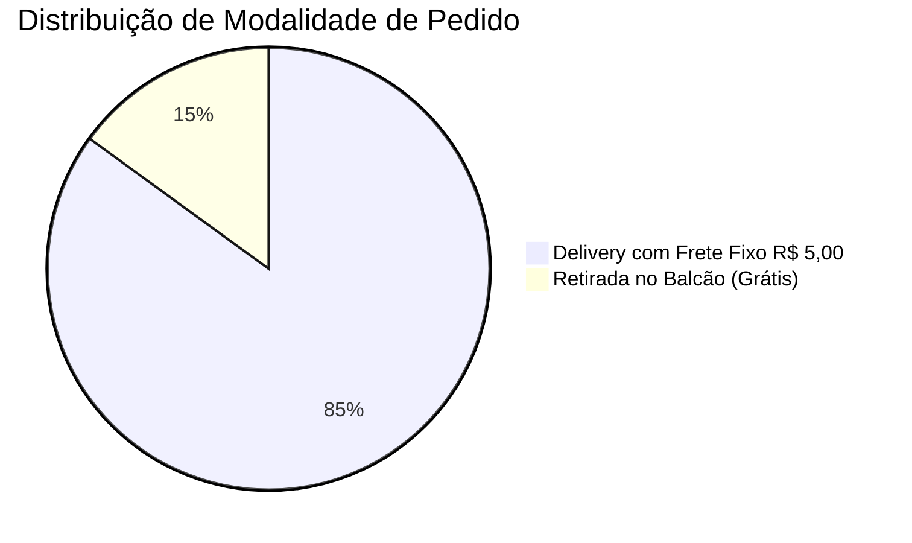

# 📋 Regras de Negócio & Políticas — Davi Lanches

> [!NOTE] **Diretrizes Oficiais de Operação**  
> Estas regras regem o funcionamento do cardápio digital, o processamento de pedidos na chapa e o atendimento aos clientes da Davi Lanches.

---

## 🛵 1. Política de Frete e Entregas

### Regras do Frete Fixo:
- **Valor**: **R$ 5,00 por pedido completo**, independentemente da quantidade de itens solicitados (seja 1 refrigerante ou 5 combos).
- **Área de Cobertura**: Bairros atendidos no Rio de Janeiro pela equipe de motoboys da loja.
- **Isenção de Frete**: Aplicada automaticamente quando o cliente escolhe a opção **Retirada no Local (Hamburgueria)**.

---

## 🍳 2. Regras de Customização e Adicionais

1. **Remoções de Ingredientes**:
   - É permitida a remoção de salada (alface/tomate), molho especial e cebola.
   - Remoções não geram desconto ou abatimento no valor do lanche.
2. **Adicionais Pagos**:
   - Cada adicional possui valor tabelado somado ao valor unitário do lanche antes da multiplicação pela quantidade.
   - Fórmula de Cálculo do Item:  
     $$\text{Total do Item} = (\text{Preço Base} + \sum \text{Adicionais}) \times \text{Quantidade}$$
3. **Observações Livres**:
   - O campo de texto livre permite especificações de preparo (ex: *"carne bem passada"*, *"sem sal na batata"*, *"molho à parte"*).

---

## 💳 3. Políticas de Pagamento

| Forma de Pagamento | Condição & Processamento |
|---|---|
| **PIX Instantâneo** | O cliente finaliza o pedido e recebe a Chave PIX oficial no WhatsApp; a produção inicia após envio do comprovante. |
| **Cartão de Crédito** | O motoboy leva a maquininha sem fio até a residência do cliente (Visa, Mastercard, Elo, etc.). |
| **Cartão de Débito** | Pagamento via aproximação ou chip na entrega. |
| **Dinheiro em Espécie** | Obrigatório informar o valor para troco no formulário para que o entregador saia com o troco correto da loja. |

---

## ⏰ 4. Horários de Funcionamento

- **Segunda-feira**: Fechado para descanso da equipe e manutenção preventiva.
- **Terça a Domingo**: Aberto a partir das **18:00h** até o encerramento do expediente noturno.
- **Feriados**: Funcionamento em regime especial anunciado nas redes sociais (@DAVILANCHES).

---

## ❓ 5. Perguntas Frequentes (FAQ Técnico & Comercial)

### P1: O que acontece se o cliente acessar pelo computador sem WhatsApp desktop?
> **R:** O navegador abrirá automaticamente o **WhatsApp Web** em uma nova aba com o texto do pedido pronto para envio, bastando escanear o QR code caso ainda não esteja conectado.

### P2: O carrinho se perde se a página for recarregada?
> **R:** Não. O carrinho utiliza persistência em `localStorage`. Caso o cliente dê F5 ou a bateria do celular acabe, os itens selecionados permanecem salvos quando ele reabrir o site.

### P3: É possível aplicar cupons de desconto?
> **R:** Na versão atual, os descontos já vêm aplicados nativamente nos combos promocionais. Para a próxima versão, está prevista a inclusão de um campo de cupom no checkout (ver [[09 - Roadmap & Oportunidades de Evolução]]).

---

## 🔗 Navegação Entre Notas
- Anterior: [[07 - Guia de Manutenção & Atualização]]
- Próxima Nota: [[09 - Roadmap & Oportunidades de Evolução]]
- Mapa Geral: [[00 - MOC (Map of Content) - Davi Lanches]]
- Fluxo de Checkout: [[05 - Fluxo de Pedido & Checkout WhatsApp]]
