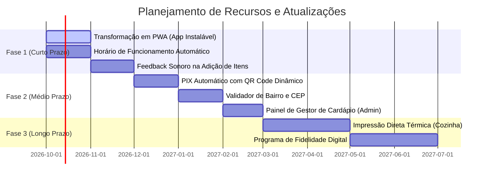

# 🚀 Roadmap & Oportunidades de Evolução — Davi Lanches

> [!INFO] **Visão Estratégica de Crescimento**  
> O projeto atual entrega com perfeição a experiência de pedido rápido e sem atrito. Abaixo estão mapeadas as oportunidades para transformar o cardápio digital em um ecossistema completo de delivery para a Davi Lanches.

---

## 🗺️ 1. Linha do Tempo de Evolução Planejada



---

## 📱 2. Fase 1: Curto Prazo (Quick Wins)

### 2.1. Transformação em PWA (Progressive Web App)
- **Objetivo**: Permitir que o cliente instale o ícone do Davi Lanches diretamente na tela inicial do celular Android ou iPhone, funcionando como um app nativo.
- **Implementação**:
  - Criação do arquivo `manifest.json` com ícones oficiais e cores de tema.
  - Implementação de um `sw.js` (Service Worker) para cache offline dos assets principais.

### 2.2. Detector Automático de Loja Aberta/Fechada
- **Objetivo**: Evitar pedidos de clientes fora do expediente da hamburgueria.
- **Lógica**:
  ```javascript
  const now = new Date();
  const day = now.getDay(); // 0: Domingo, 1: Segunda ...
  const hour = now.getHours();
  const isOpen = (day !== 1) && (hour >= 18 || hour < 2); // Terça a Domingo a partir das 18h até 02h
  ```
  - Se fechado: Exibir aviso amigável `"Nosso atendimento começa às 18:00h! Você pode antecipar sua escolha."`.

### 2.3. Campo de Cupom Promocional
- Permitir a criação de cupons como `DAVILANCHES10` ou `BEMVINDO5` no checkout com desconto abatido automaticamente do subtotal.

---

## 💳 3. Fase 2: Médio Prazo (Automação Financeira & Logística)

### 3.1. Integração com PIX Dinâmico (Mercado Pago / EFI)
- Gerar o QR Code do PIX e o código "Copia e Cola" instantaneamente no modal de checkout.
- Quando o cliente paga, o status é confirmado e o pedido já chega com selo de **"PAGO VIA PIX"** no WhatsApp.

### 3.2. Validador de CEP e Bairros de Entrega
- Autocompletar rua e bairro a partir do CEP usando a API gratuita do ViaCEP (`viacep.com.br/ws/{cep}/json/`).
- Bloquear pedidos fora do raio de entrega com mensagem cordial.

### 3.3. Painel Administrativo Leve
- Uma tela oculta protegida por senha simples (ex: `davilanches.com.br/admin`) para pausar itens esgotados (ex: *"Acabou o refrigerante lata"*) sem precisar abrir código-fonte.

---

## 🖨️ 4. Fase 3: Longo Prazo (Escala & Cozinha)

### 4.1. Impressão Térmica Direta na Cozinha
- Disparo de impressão em impressoras térmicas de 58mm ou 80mm (ESC/POS) assim que o WhatsApp ou Webhook receber a comanda.
- Separação automática entre comandas da **Chapa** e comandas do **Balcão/Bebidas**.

### 4.2. Programa de Fidelidade Integrado
- Controle de pontos pelo número de telefone do cliente: a cada 10 lanches pedidos, ganha 1 X-Burguer ou Batata Frita na próxima compra.

---

## 🔗 Navegação Entre Notas
- Anterior: [[08 - Regras de Negócio & Políticas]]
- Início: [[00 - MOC (Map of Content) - Davi Lanches]]
- Guia de Manutenção: [[07 - Guia de Manutenção & Atualização]]
